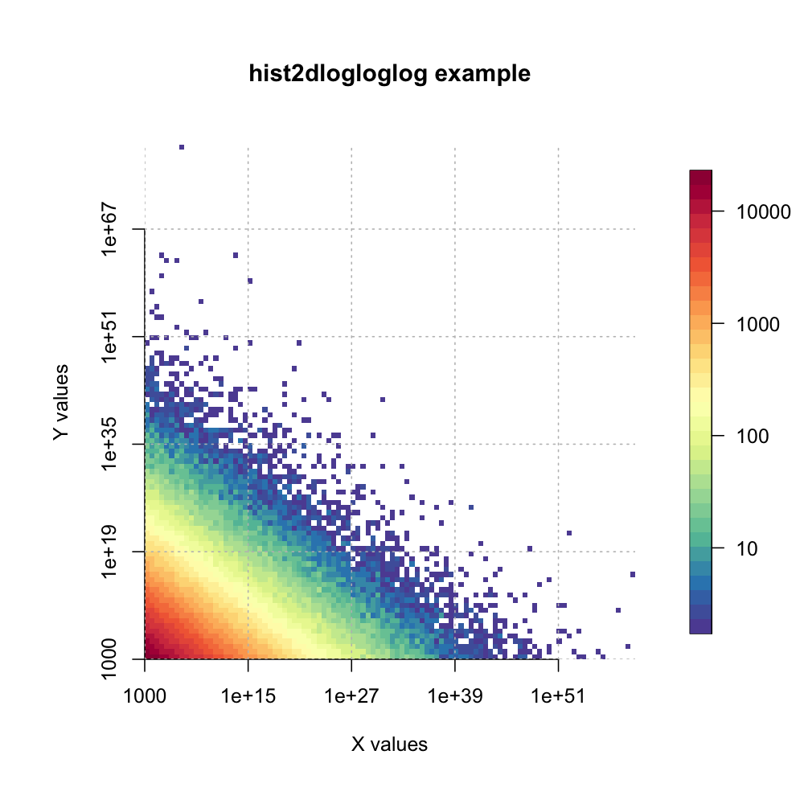
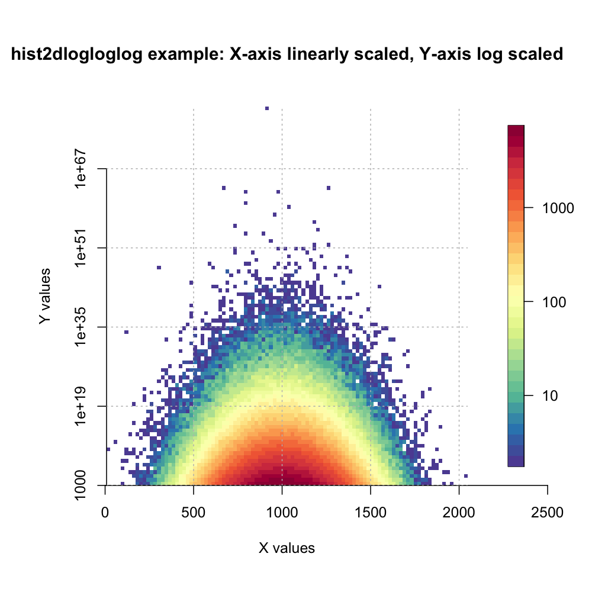

# R hist2dlogloglog

2-dimensional histogram with support logarithmic axes (X,Y, and color-coded Z axis).

Allows for visualization of heavily skewed data.

## Installation / Dependencies

### Dependencies
```r
install.packages("gplots") # contains original hist2d, which hist2dlogloglog is based on.
install.packages("RColorBrewer") # required for beautiful colors.
install.packages("fields") # required to plot z-axis legend.
install.packages("scales") # required for log-scale axis computations.
```
### Load hist2dplus
```r
source("hist2dlogloglog.R")

```

## Example 1: both x- and y-axis log scaled, counts (z-axis) log scaled

```r
# generate heavily skewed data, e.g., from a Pareto distribution. 

library(Pareto)

#let's assume our datapoints have two properties that we want to visualize (x and y).

x = rPareto(1000000,1000,0.1)
y = rPareto(1000000,1000,0.1)

#summary(x)
#     Min.   1st Qu.    Median      Mean   3rd Qu.      Max. 
#1.000e+03 1.774e+04 1.010e+06 9.033e+53 1.035e+09 8.027e+59

# (yep, that data is heavily skewed)

hist2dlogloglog(x,y,log="xyz",xlab="X values" ,ylab="Y values", main="hist2dlogloglog example")
```



## Example 2: x-axis linear scale, y-axis log scaled, counts (z-axis) log scaled

Sometimes, only one property may be heavily skewed, while another one is not.

```r

x = abs(rnorm(1000000,1000,200))
# summary(x)
#    Min.  1st Qu.   Median     Mean  3rd Qu.     Max. 
#   8.236  865.246 1000.267 1000.204 1135.344 2048.304 

# values in x are not heavy-tailed.

y = rPareto(1000000,1000,0.1)
# summary(y)
#     Min.   1st Qu.    Median      Mean   3rd Qu.      Max. 
#1.000e+03 1.769e+04 1.016e+06 3.567e+73 1.038e+09 3.567e+79 

# values in y are very much heavy-tailed.

# plot histogram, but only use logarithmic axes for y axis and for the counts (z axis).

hist2dlogloglog(x,y,log="yz",xlab="X values" ,ylab="Y values", main="hist2dlogloglog example: X-axis linearly scaled, Y-axis log scaled")
```

